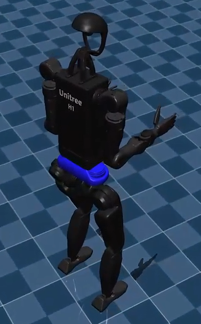

### ``H1_2`` 相比于 ``H1`` 简化了机器人的上半身
故选用 ``H1_2``

### base height 是通过这个关节的声明高度和 reward 函数里面的设置去对齐的

### 在 perturbence 里面加上了一个 h 方向上的 随机
给了max 是 1，比较寄。然后步态就会变得很慢

### 其身高是 1.80 cm
训练的``base_height``降低到 1.7m 试试

### 步频是b变慢了很多
把 z 方向上的速度随机再训练一次